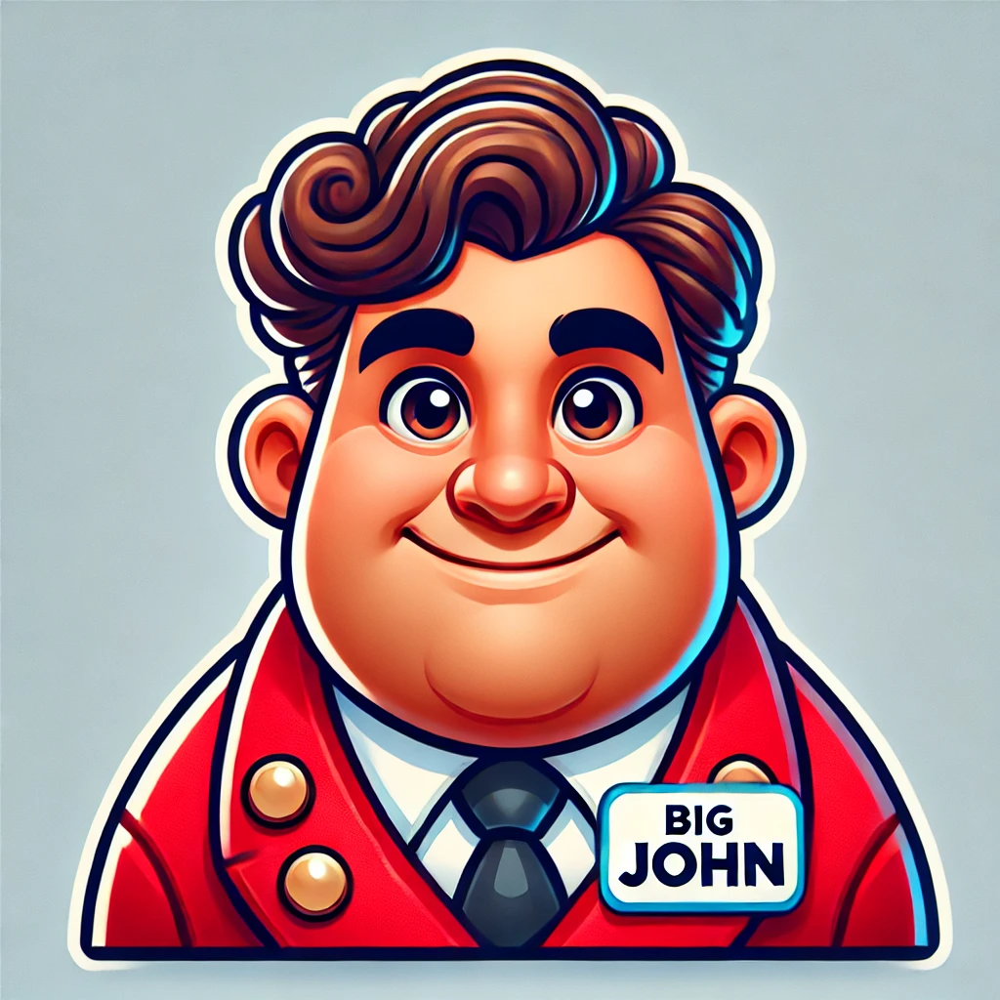

# Big John - Concierge Chatbot Server

Welcome to the **Big John**! Big John is your friendly, consummate, and gregarious virtual concierge. Big John will help you book an appointment with his friends in just a few messages - whether that be a local restaurant, nail salon or barber! Just text Big John when and where you'd like to book to begin!

## About Big John

Big John is always ready to lend a helping hand. His warm smile, expressive eyes, and solid build make him approachable and trustworthy. He’s dressed to impress in a red concierge coat, complete with a name tag that proudly reads "Big John." With his larger-than-life personality and memorable hair, Big John is not only friendly but also a bit quirky. Whether it's providing information, answering questions, or assisting with tasks, Big John ensures users have a pleasant and efficient experience.

***
Big John is a cutting-edge AI-powered appointment booking software designed specifically for the beauty industry. Whether you're running a nail salon, hair salon, or offering makeup artist services, Big John streamlines your booking process and enhances customer experience.
Key Features

Intelligent Scheduling: Big John uses advanced AI algorithms to optimize appointment scheduling, maximizing your business efficiency.
Multi-Service Support: Seamlessly manage bookings for various beauty services, including:

Nail salons
Hair salons
Makeup artists (MUAs)

24/7 Availability: Allow your clients to book appointments anytime, anywhere.
User-Friendly Interface: Easy-to-use platform for both service providers and clients.
Customizable Options: Tailor Big John to fit your specific business needs and branding.

## Benefits

Increased Efficiency: Reduce no-shows and double-bookings with smart scheduling.
Enhanced Customer Satisfaction: Provide a smooth, hassle-free booking experience for your clients.
Time-Saving: Automate your appointment management, freeing up time for you to focus on your craft.
Data Insights: Gain valuable insights into booking patterns and customer preferences.

Getting Started
Visit our website at www.bigjohnbooking.com to sign up for a free trial and experience the future of beauty service scheduling!

***

# Technical Notes

## postgres
`docker run --name postgres16 -p 5432:5432 -e POSTGRES_USER=root -e POSTGRES_PASSWORD=password -d postgres:16-alpine`

## Telegram
`curl -F "url=https://your-ngrok-url.ngrok.io/telegram/webhook" https://api.telegram.org/bot<YOUR_BOT_TOKEN>/setWebhook`

## Version Tagging System

This project uses a version tagging system for Docker images based on Git tags and commits. Here's how it works:

1. **Versioning**: 
   - Uses `git describe --tags --always --dirty` to generate version tags.
   - Format: `<latest-tag>-<commits-since-tag>-g<commit-hash>` (e.g., v1.0.0-3-g1234567).
   - Falls back to "dev" if no Git information is available.

2. **Building**:
   - `make build`: Creates a Docker image tagged with the current version and "latest".

3. **Running**:
   - `make run` or `make run-env`: Runs the container with the current version tag.
   - Specify version: `make run VERSION=v1.0.0`

4. **Utility Commands**:
   - `make version`: Displays the current version.
   - `make clean`: Removes both versioned and "latest" tagged images.

5. **Workflow**:
   - Tag releases: `git tag v1.0.0`
   - Build: `make build`
   - Run: `make run`

This system ensures each Docker image is tied to a specific code version, facilitating easier debugging and version management.
