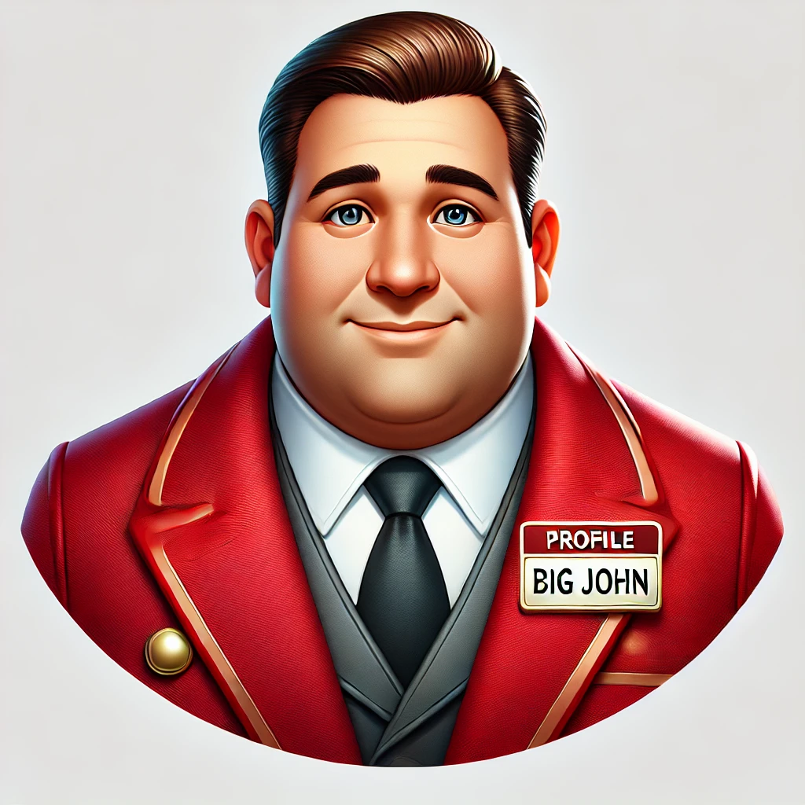

# Big John - Concierge Chatbot Server

Welcome to the **Big John Concierge Chatbot Server**! Big John is your friendly, consummate, and gregarious virtual concierge. He is designed to assist users with their needs, providing a professional yet approachable service experience.

## About Big John

Big John is always ready to lend a helping hand. His warm smile, expressive eyes, and solid build make him approachable and trustworthy. He’s dressed to impress in a red concierge coat, complete with a name tag that proudly reads "Big John." With his larger-than-life personality and memorable hair, Big John is not only friendly but also a bit quirky. Whether it's providing information, answering questions, or assisting with tasks, Big John ensures users have a pleasant and efficient experience.

## Features

- **Friendly and Approachable**: Big John's demeanor puts users at ease, making him the perfect assistant for any task.
- **Professional Concierge Service**: Dressed in a red concierge coat with a name tag, Big John embodies professionalism while maintaining a personal touch.
- **Unique Appearance**: Big John’s distinctive look, complete with memorable hair and a warm smile, makes him a character that users won’t forget.

## Version Tagging System

This project uses a version tagging system for Docker images based on Git tags and commits. Here's how it works:

1. **Versioning**: 
   - Uses `git describe --tags --always --dirty` to generate version tags.
   - Format: `<latest-tag>-<commits-since-tag>-g<commit-hash>` (e.g., v1.0.0-3-g1234567).
   - Falls back to "dev" if no Git information is available.

2. **Building**:
   - `make build`: Creates a Docker image tagged with the current version and "latest".

3. **Running**:
   - `make run` or `make run-env`: Runs the container with the current version tag.
   - Specify version: `make run VERSION=v1.0.0`

4. **Utility Commands**:
   - `make version`: Displays the current version.
   - `make clean`: Removes both versioned and "latest" tagged images.

5. **Workflow**:
   - Tag releases: `git tag v1.0.0`
   - Build: `make build`
   - Run: `make run`

This system ensures each Docker image is tied to a specific code version, facilitating easier debugging and version management.